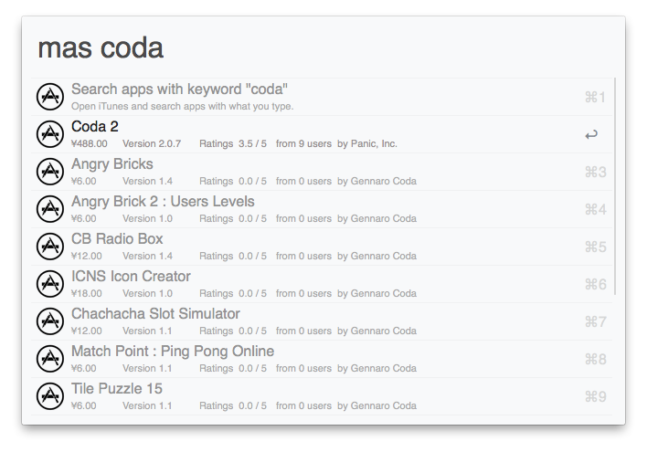
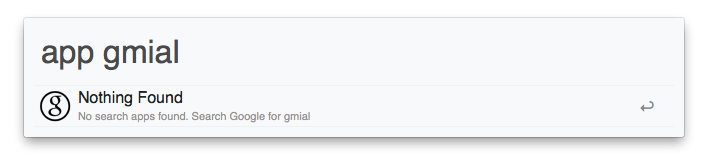

## Alfred Workflow for App Store

This Alfred Workflow is used for searching apps at iTunes or Mac App Store.




### How to use

You can use it like this:

```
app angry birds
```
or
```
mas angry birds
```
